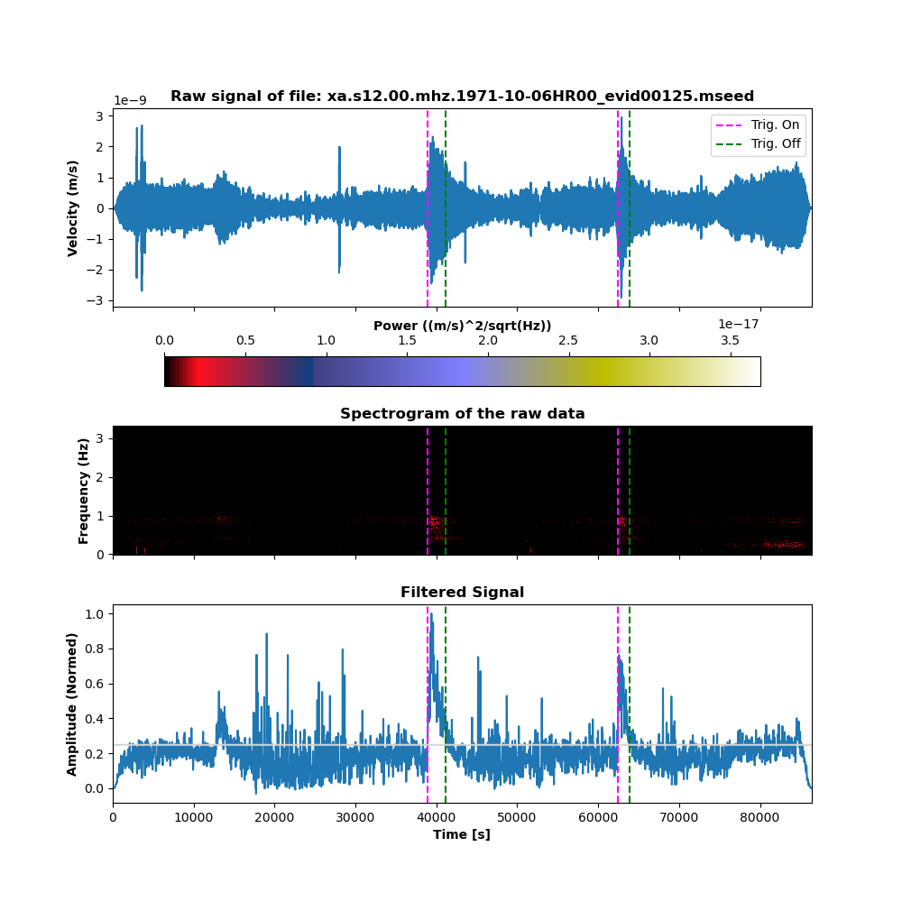
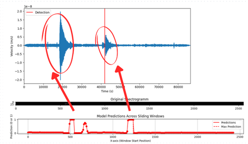
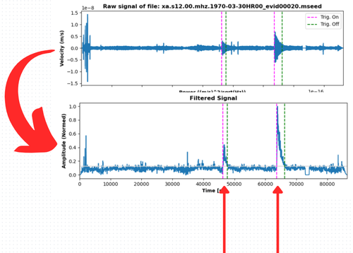

# NOTE: To view the demo of the project please download 'Demo.mp4'

# Seismic Detection Across the Solar System

This project contains three main scripts for filtering, detecting, and analyzing seismic events from NASA's provided datasets in CSV format.

## Scripts Overview

### 1. `identifier_prefiltered_final.py`
This is the main script for filtering and detecting seismic events. It allows multiple seismic events to be identified and plotted from a given dataset in CSV format.

#### Result

### 2. `Seismic_ML.ipynb`
This notebook is responsible for the machine learning model, which detects the start of seismic events. The detected event starts are written into a catalogue file. The NASA CSV datasets are used as input.

#### Result

### 3. `filtering_of_data_from_ML.py`
This script analyzes a window around the detection from the ML model and provides a more accurate detection, including the on- and off-triggers.

#### Result

    

